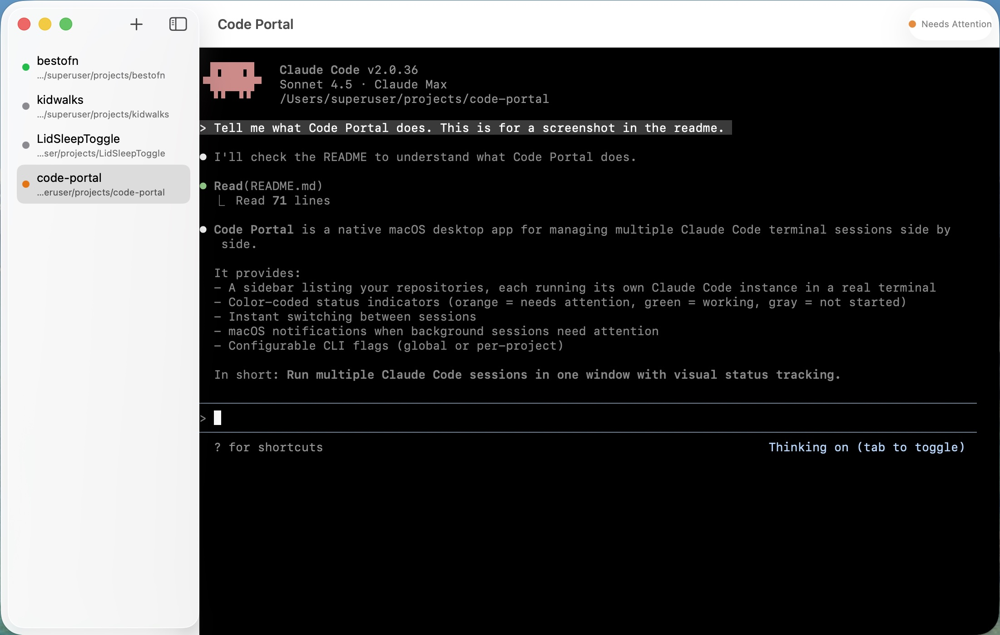

# Code Portal

A native macOS desktop app for managing multiple [Claude Code](https://docs.anthropic.com/en/docs/claude-code) terminal sessions side by side.

Code Portal gives you a single window with a sidebar listing your repositories. Each repo runs its own Claude Code instance in a real terminal (powered by [SwiftTerm](https://github.com/migueldeicaza/SwiftTerm)). Color-coded status indicators show you at a glance which sessions need your attention and which are still working.

Now you're thinking with portals.



## Download

**[Download Code Portal.dmg](https://github.com/aenrichus/code-portal/raw/main/build/38/Code%20Portal.dmg)** (macOS 14.0+)

Open the DMG and drag Code Portal to your Applications folder. You'll also need [Claude Code](https://docs.anthropic.com/en/docs/claude-code) installed and available on your PATH.

To build from source (requires Swift 6.0+):

```
./scripts/build-app.sh
```

## Release Notes

### v1.2.1 (Build 38)

- **Image preview** — Image files (PNG, JPG, GIF, WebP, HEIC, SVG, etc.) now display in the file viewer popup, scaled to fit the window. Up to 10MB supported.
- **Fix: Restart session keyboard input** — Restarting a session via right-click no longer breaks keyboard input. Root cause was a race condition in SwiftTerm's async process lifecycle.
- **Fix: Global settings on restart** — Global CLI flags from Settings now correctly apply on session restart instead of using stale cached values.

### v1.2.0 (Build 31)

- **Text file viewer** — Double-click or right-click > View File on any file in the file tree to open a read-only popup window with syntax highlighting powered by [Highlightr](https://github.com/raspu/Highlightr). Supports auto-detected language highlighting, dark/light theme matching, and graceful handling of binary files and large files (>1MB).
- **Context-aware Cmd+W** — Cmd+W now closes file viewer and About popups first, only removing the selected project when the main window is focused.
- **Path security** — File viewer uses path-component validation (not string prefix) to prevent symlink traversal outside the project directory.

### v1.1.0 (Build 29)

- **Dark/Light mode** — 3-way appearance toggle (Dark, Light, Auto) in Settings (Cmd+,). Auto follows your macOS system appearance. Terminal colors update instantly with matched ANSI palettes for each mode.
- **Filesystem viewer** — Collapsible file tree panel in the right sidebar. Toggle with the toolbar button or Cmd+Shift+B. Lazy-loaded directory tree with context menus for Reveal in Finder, Copy Path, and Open in Default Editor.

### v1.0.1 (Build 26)

- **About window** — Added About Code Portal panel (Code Portal menu > About Code Portal) with version info and attribution.
- **Permanent window title** — Toolbar now always shows "Code Portal" instead of the selected project name.
- **DMG volume icon** — The mounted DMG now shows the Code Portal icon instead of the default disk image icon.

### v1.0 (Build 20)

Initial public release.

- **Multi-repo session management** — Run multiple Claude Code instances side by side. Add repositories to the sidebar and switch between sessions instantly.
- **Attention detection** — Color-coded sidebar indicators show session state at a glance. Orange means Claude is asking a question, requesting permission, or waiting for input. Green means Claude is actively working. Gray means the session hasn't started yet.
- **Real terminal emulation** — Full PTY-backed terminal powered by SwiftTerm with keyboard input, ANSI color rendering, scrollback, and mouse support.
- **macOS notifications** — Get notified when a background session needs attention so you can keep working in another app.
- **Session persistence** — Your repo list and working directories are saved automatically and restored on launch.
- **Configurable CLI flags** — Set global flags (Cmd+,) or per-project flags (right-click > Edit Settings) passed to Claude Code on launch. Useful for `--model`, `--verbose`, `--permission-mode`, and other CLI options. Per-project flags are appended after global flags.
- **DMG installer** — Styled drag-to-install DMG with every build.

## Next Steps

- **Code signing** — Sign and notarize the app through the Apple Developer Program so users don't see Gatekeeper warnings on first launch.
- **Icon transparency** — Fix the app and DMG icon to use a proper transparent background instead of the current composited dark fill.

## How It Works

Claude Code is an Ink (React for CLI) TUI that renders via cursor repositioning rather than newline-delimited output. Code Portal reads SwiftTerm's parsed visible buffer on a debounced timer (500ms after the last output chunk) and scans for known attention patterns: permission prompts, multi-choice questions, and the idle input prompt.

## Project Structure

```
Sources/
  CodePortalApp.swift              App entry point
  Managers/SessionManager.swift    Session lifecycle and terminal pool
  Models/FileContent.swift         File content model with async loading
  Models/FileNode.swift            Recursive file tree model
  Models/TerminalSession.swift     Session state and event model
  Terminal/AttentionDetector.swift  Pure-function attention detection
  Terminal/MonitoredTerminalView.swift  SwiftTerm subclass with buffer scanning
  Views/ContentView.swift          Main split view with file tree panel
  Views/FileTreeView.swift         Collapsible file browser sidebar
  Views/FileViewerView.swift       Syntax-highlighted file viewer popup
  Views/SettingsView.swift         Global settings (Cmd+,)
  Views/SidebarView.swift          Repo list with status indicators
  Views/SessionDetailView.swift    Terminal host view
Tests/
  AttentionDetectorTests.swift     60 tests for detection logic
```

## License

MIT License. See [LICENSE](LICENSE) for details.
